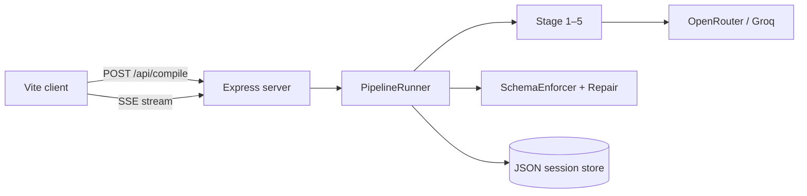

# Agios

**Natural language → validated application specification compiler.**

Agios takes a plain-English description of an app and runs it through a multi-stage pipeline backed by LLMs. Each stage output is schema-enforced, repairable, and streamed to the UI in real time. The final artifact is a structured spec (and optional generated scaffold) you can hand to engineers or downstream tools.

---

## Features

- **5-stage compilation pipeline** — intent → design → schemas → refinement → runtime scaffold
- **Schema enforcement & auto-repair** — invalid LLM JSON is caught and retried before the next stage runs
- **Live progress (SSE)** — watch each stage start, complete, or fail in the browser
- **Session history** — past compilations stored on disk and browsable from the UI
- **Dual LLM providers** — OpenRouter primary with Groq fallback (`server/llm/client.js`)
- **Offline / demo mode** — deterministic compiler when API keys are missing or `AGIOS_LOCAL_MODE=true`

---

## Pipeline stages

| # | Stage | Purpose |
|---|--------|---------|
| 1 | Intent Extraction | Parse NL into a typed intermediate representation |
| 2 | System Design | Modules, actors, flows, constraints |
| 3 | Schema Generation | API, database, UI, and auth structures |
| 4 | Refinement Layer | Cross-layer validation and consolidated spec |
| 5 | Runtime Generation | Scaffold files written under `server/generated-apps/` |

---

## Project structure

```
agios/
├── client/                 # Vite frontend (static UI)
│   ├── src/
│   │   ├── components/     # Input, pipeline progress, stage viewer, history
│   │   └── utils/api.js    # Backend API client
│   └── index.html
├── server/                 # Express API + pipeline
│   ├── index.js            # Server entry
│   ├── routes/             # /api/compile, /api/sessions
│   ├── stages/             # Stage implementations
│   ├── pipeline/           # Runner, registry, repair, contracts
│   ├── enforcement/        # Validators + SchemaEnforcer
│   ├── llm/                # OpenRouter / Groq client
│   ├── data/               # Persistent JSON session store
│   └── .env                # Secrets (not committed)
└── package.json            # Root dev script (runs client + server)
```

---

## Prerequisites

- **Node.js** 18+ (20+ recommended)
- **npm** 9+
- API keys for live LLM mode (at least one):
  - [OpenRouter](https://openrouter.ai/) — `OPENROUTER_API_KEY`
  - [Groq](https://console.groq.com/) — `GROQ_API_KEY` (fallback)

---

## Quick start

### 1. Clone and install

```bash
git clone <your-repo-url>
cd agios
npm install
cd server && npm install && cd ..
cd client && npm install && cd ..
```

Or from the repo root after adding workspace installs:

```bash
npm install
npm --prefix server install
npm --prefix client install
```

### 2. Configure the server

Copy environment variables into `server/.env`:

```env
OPENROUTER_API_KEY=your-openrouter-key
OPENROUTER_MODEL=google/gemini-2.5-flash
GROQ_API_KEY=your-groq-key
PORT=3002
```

Optional:

| Variable | Description |
|----------|-------------|
| `HOST` | Bind address (use `0.0.0.0` on cloud hosts) |
| `CORS_ORIGINS` | Comma-separated browser origins allowed by CORS |
| `SERVER_PUBLIC_URL` | Public URL sent as OpenRouter HTTP-Referer |
| `AGIOS_LOCAL_MODE` | Set to `true` to skip LLM calls (deterministic demo) |

### 3. Point the client at the API

In `client/src/utils/api.js`, set `API_BASE` to match your server port, or use an env-driven URL for production:

```js
const API_BASE = import.meta.env.VITE_API_BASE_URL || 'http://localhost:3002/api';
```

### 4. Run locally

From the repo root:

```bash
npm run dev
```

| Service | Default URL |
|---------|-------------|
| Frontend (Vite) | http://localhost:5173 |
| Backend (Express) | http://localhost:3002 (see terminal banner if port is in use) |

**Port conflicts:** If 5173 or 3002 are taken, stop other Node processes or change `PORT` in `server/.env` and update `API_BASE` in `client/src/utils/api.js` to match the port printed in the server startup log.

### 5. Verify the API

```bash
curl http://localhost:3002/api/health
```

---

## Scripts

| Command | Location | Description |
|---------|----------|-------------|
| `npm run dev` | root | Runs client + server with `concurrently` |
| `npm run dev:server` | root | Server only (`nodemon`) |
| `npm run dev:client` | root | Vite dev server only |
| `npm start` | `server/` | Production server (`node index.js`) |
| `npm run build` | `client/` | Production static build → `client/dist` |
| `npm run evaluate` | `server/` | Run pipeline evaluation harness |

---

## API overview

| Method | Path | Description |
|--------|------|-------------|
| `GET` | `/api/health` | Health check |
| `POST` | `/api/compile` | Start compilation (`{ "raw_input": "..." }`) → `202` + `session_id` |
| `GET` | `/api/compile/:id/stream` | SSE progress stream |
| `GET` | `/api/compile/:id` | Full session / result |
| `GET` | `/api/sessions` | List compilation history |
| `GET` | `/api/sessions/:id` | Session detail |

---

## Deployment (Vercel + Render)

Typical split: **static frontend on Vercel**, **Node API on Render**.

### Render (backend)

1. New **Web Service** → connect repo.
2. **Root directory:** `server`
3. **Build:** `npm install` · **Start:** `npm start`
4. Set environment variables (`OPENROUTER_API_KEY`, `GROQ_API_KEY`, `CORS_ORIGINS`, etc.).
5. Render sets `PORT` automatically; bind with `HOST=0.0.0.0` if needed.

Example `CORS_ORIGINS`:

```env
CORS_ORIGINS=https://your-app.vercel.app
```

### Vercel (frontend)

1. New project → **Root directory:** `client`
2. **Build:** `npm run build` · **Output:** `dist`
3. Environment variable:

```env
VITE_API_BASE_URL=https://your-service.onrender.com/api
```

Redeploy after changing `VITE_*` variables (they are baked in at build time).

> **Note:** Sessions are stored as JSON files under `server/data/sessions/`. On Render’s ephemeral filesystem, history may not survive redeploys unless you add persistent storage or a database.

---

## How it works (high level)



1. User submits NL text from the client.
2. Server creates a session and runs stages sequentially.
3. Each stage output passes through enforcement; failures trigger repair or halt the pipeline.
4. Progress events broadcast over SSE; the UI renders stage JSON and the final spec card.

---

## Development notes

- **Never commit** `server/.env` — it is listed in `.gitignore`.
- **Generated output** — `server/generated-apps/` is gitignored.
- **Tests** — enforcement unit tests: `server/enforcement/__tests__/enforcement.test.js`
- **Evaluation** — `npm run evaluate` in `server/` (sets local mode by default in the eval script)

---

## License

Private / all rights reserved unless otherwise specified by the repository owner.
